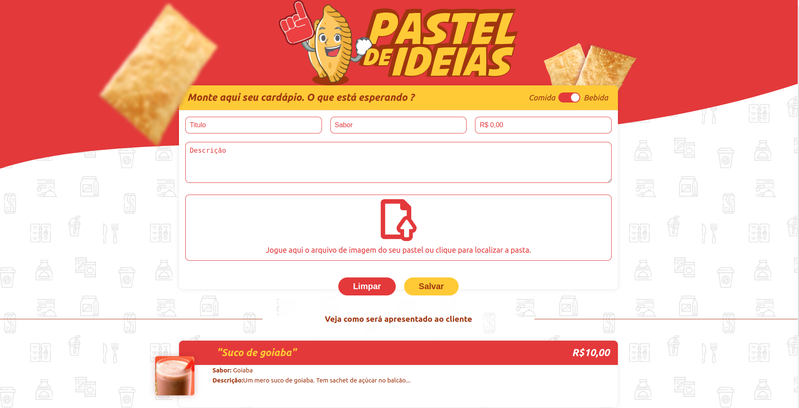

<p align="center">
  <h3 align="center">Pastel de ideias</h3>
</p>
<p align="center">
  
  
</p>

## 🗂 Table of Contents

* [About the Project](#book-about-the-project)
  * [Technologies](#computer-technologies)
  * [Layout](#art-layout)
* [Installation](#bricks-installation)
  * [Dependencies](#construction-installing-dependencies)
  * [Web](#file_cabinet-back-end)
    * [Installing Dependencies](#construction-installing-dependencies)
    * [Running](#arrow_forward-running)
* [License](#page_facing_up-license)

## :book: About The Project

It was proposed to create a single page application (SPA) where the user can create a menu for his pastry shop using VueJs

### :computer: Technologies

* [Javascript](https://www.javascript.com/)
* [VueJs](https://vuejs.org/)

### :art: Layout

You can access the project's layout in link below:

* [Layout](https://xd.adobe.com/spec/855f4c8d-dd32-45f7-784b-3b38f80782fa-f36e/specs/)


## :bricks: Installation

This project use [Node.js](https://nodejs.org/en/) and [yarn](https://yarnpkg.com/), you will need them to build its dependencies.


Clone this project repository:
```sh
git clone https://github.com/billyfranklim1/frontend-challenge.git
```
Enter in `frontend-challenge` folder:

```sh
cd frontend-challenge
```

🚨 If you don't have git in your machine, you can install it [here](https://git-scm.com/downloads).

### :construction: Installing Dependencies

Inside project folder, install dependencies with following comand:

```sh
cd server
```
```sh
yarn install
```


### :arrow_forward: Running

Run following command to start:


```sh
yarn dev
```

The Application will be avaible on [http://localhost:5173/](http://localhost:5173/). 


<p align="center">Developed with 💜 by Billyfranklim</p>